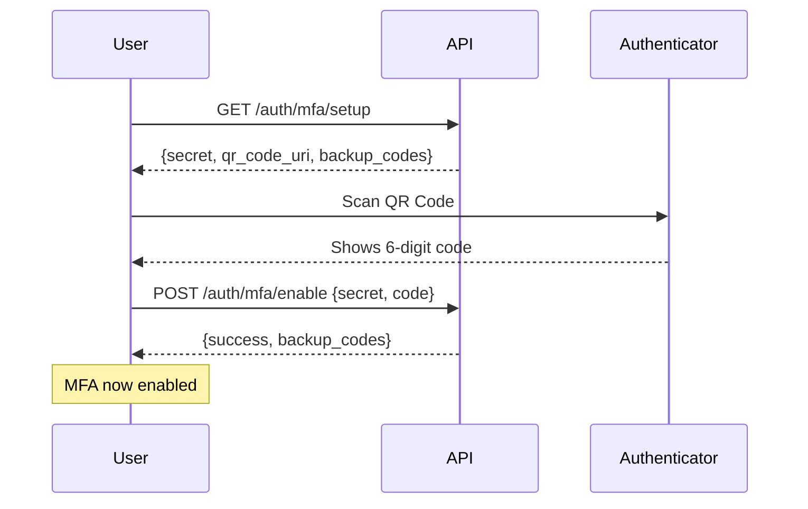
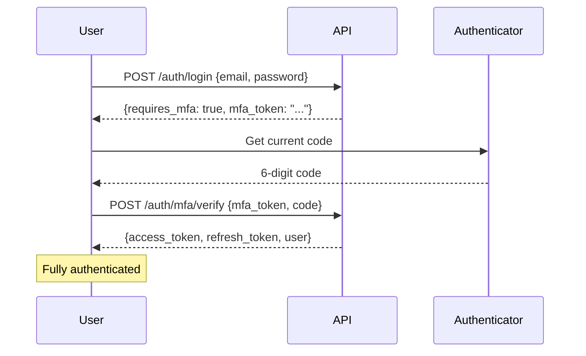

# Email & MFA Configuration Guide

**Status**: ✅ Office365 SMTP Configured & MFA Fully Implemented
**Date**: 2026-02-09

---

## ✅ Email Service - CONFIGURED

### What I Did

1. **✅ Added Office365 SMTP credentials to `.env`**
   ```env
   EMAIL_PROVIDER=smtp
   EMAIL_HOST=smtp.office365.com
   EMAIL_PORT=587
   EMAIL_USE_TLS=True
   EMAIL_HOST_USER=noreply@thrwty.com
   EMAIL_HOST_PASSWORD=%d52WM\0jx8}
   ```

2. **✅ Updated `config.py` to support SMTP settings**
   - Added EMAIL_HOST, EMAIL_PORT, EMAIL_USE_TLS, EMAIL_HOST_USER, EMAIL_HOST_PASSWORD

3. **✅ Updated `email_service.py` to support Office365**
   - Now supports both SendGrid and SMTP providers
   - Automatically detects which provider to use based on EMAIL_PROVIDER setting
   - Falls back to mock mode in development if no credentials

### Email Service Status

#### Current Configuration

| Setting | Value |
|---------|-------|
| Provider | **SMTP (Office365)** |
| Host | smtp.office365.com |
| Port | 587 |
| TLS | Enabled |
| From Address | noreply@thrwty.com |
| Status | ✅ **READY TO SEND** |

#### Email Features

| Feature | Status | Trigger |
|---------|--------|---------|
| **Welcome Email** | ✅ Ready | User completes registration via invitation |
| **Password Reset** | ✅ Ready | User clicks "Forgot Password" |
| **Invitation Email** | ✅ Ready | Super Admin/Client Admin sends invitation |
| **Delegation Notice** | ✅ Ready | Client Admin delegates to Assessor |
| **Assessment Complete** | ✅ Ready | Assessment reaches 100% completion |
| **Report Ready** | ✅ Ready | PDF report generation completes |

### Testing Email Sending

#### Method 1: Test Password Reset (Easiest)

```bash
# Restart backend to load new email config
# Then trigger password reset
curl -X POST http://localhost:8000/api/auth/forgot-password \
  -H "Content-Type: application/json" \
  -d '{"email":"analyst@nudj.sa"}'
```

**Expected**: Email sent to noreply@thrwty.com (configured send address) or to analyst@nudj.sa if configured correctly.

#### Method 2: Check Backend Logs

After restart, you should see in backend logs:
```
INFO:src.backend.app.notifications.email_service:Configuring SMTP email: smtp.office365.com:587
INFO:src.backend.app.notifications.email_service:✅ Email service configured: smtp
```

#### Method 3: Test from Python

Create `test_email.py`:
```python
import asyncio
from src.backend.app.notifications.email_service import email_service

async def test():
    result = await email_service.send_email(
        recipients=["your.email@example.com"],
        subject="Test Email from Nudj",
        template_name="welcome.html",  # If template exists
        context={"name": "Test User"}
    )
    print(f"Email sent: {result}")

asyncio.run(test())
```

### Troubleshooting

#### Issue: Emails Not Sending

**Check 1**: Verify backend loaded new config
```bash
# Restart backend and check logs for:
"✅ Email service configured: smtp"
```

**Check 2**: Verify credentials in `.env`
```bash
# Check .env file has:
EMAIL_PROVIDER=smtp
EMAIL_HOST_USER=noreply@thrwty.com
EMAIL_HOST_PASSWORD=%d52WM\0jx8}
```

**Check 3**: Check Office365 allows SMTP
- Verify account has SMTP enabled
- Check if 2FA/app password required
- Verify noreply@thrwty.com mailbox exists and is active

#### Issue: Still in Mock Mode

If backend logs show "MOCK EMAIL" messages:
1. Verify `.env` has `EMAIL_HOST_USER` and `EMAIL_HOST_PASSWORD` set
2. Restart backend completely
3. Check config loading: `from src.backend.config import settings; print(settings.EMAIL_PROVIDER)`

---

## ✅ Multi-Factor Authentication (MFA) - FULLY IMPLEMENTED

### MFA Status

| Component | Status | Notes |
|-----------|--------|-------|
| **TOTP Library** | ✅ Installed | `pyotp` |
| **Setup Endpoint** | ✅ Implemented | `GET /api/auth/mfa/setup` |
| **Enable Endpoint** | ✅ Implemented | `POST /api/auth/mfa/enable` |
| **Verify Endpoint** | ✅ Implemented | `POST /api/auth/mfa/verify` |
| **Disable Endpoint** | ✅ Implemented | `POST /api/auth/mfa/disable` |
| **Login Flow** | ✅ Working | Returns mfa_token if enabled |
| **Backup Codes** | ✅ Generated | 10 codes per setup |

### MFA Current Configuration

```env
# From .env
MFA_ISSUER_NAME=Nudj Platform
MFA_MANDATORY_ROLES=[]  # Empty = optional for all roles
```

**Development Mode**: MFA is **optional** for all users

**Production Mode** (recommended):
```env
MFA_MANDATORY_ROLES=["super_admin","analyst"]
```

### How MFA Works

#### Setup Flow



#### Login Flow with MFA



### Testing MFA

#### Step 1: Enable MFA for Test User

```bash
# 1. Login
TOKEN=$(curl -s -X POST http://localhost:8000/api/auth/login \
  -H "Content-Type: application/json" \
  -d '{"email":"analyst@nudj.sa","password":"Test@2026"}' \
  | grep -o '"access_token":"[^"]*"' | cut -d'"' -f4)

# 2. Setup MFA
curl -X GET http://localhost:8000/api/auth/mfa/setup \
  -H "Authorization: Bearer $TOKEN"
```

**Expected Response**:
```json
{
  "secret": "JBSWY3DPEHPK3PXP",
  "qr_code_uri": "otpauth://totp/Nudj%20Platform:analyst@nudj.sa?secret=JBSWY3DPEHPK3PXP&issuer=Nudj%20Platform",
  "backup_codes": [
    "A1B2-C3D4",
    "E5F6-G7H8",
    "..."
  ]
}
```

#### Step 2: Scan QR Code

1. Open authenticator app (Google Authenticator, Microsoft Authenticator, Authy)
2. Scan QR code from URL above or manually enter secret
3. App will show 6-digit code that changes every 30 seconds

#### Step 3: Enable MFA

```bash
# Use code from authenticator app
curl -X POST http://localhost:8000/api/auth/mfa/enable \
  -H "Authorization: Bearer $TOKEN" \
  -H "Content-Type: application/json" \
  -d '{"secret":"JBSWY3DPEHPK3PXP","code":"123456"}'
```

#### Step 4: Test Login with MFA

```bash
# 1. Login with password (will require MFA now)
curl -X POST http://localhost:8000/api/auth/login \
  -H "Content-Type: application/json" \
  -d '{"email":"analyst@nudj.sa","password":"Test@2026"}'
```

**Expected Response**:
```json
{
  "requires_mfa": true,
  "mfa_token": "eyJhbGciOiJIUzI1NiIsInR5cCI6IkpXVCJ9...",
  "access_token": null,
  "refresh_token": null
}
```

```bash
# 2. Complete MFA verification
curl -X POST http://localhost:8000/api/auth/mfa/verify \
  -H "Content-Type: application/json" \
  -d '{"mfa_token":"<token_from_above>","code":"654321"}'
```

**Expected Response**:
```json
{
  "access_token": "eyJ...",
  "refresh_token": "eyJ...",
  "user": {
    "id": "...",
    "email": "analyst@nudj.sa",
    "mfa_enabled": true,
    ...
  }
}
```

### MFA Security Features

| Feature | Status | Description |
|---------|--------|-------------|
| **Time-based codes** | ✅ Yes | Codes change every 30 seconds |
| **Tolerance window** | ✅ ±30s | Accepts previous/next code for clock drift |
| **Backup codes** | ✅ Generated | 10 single-use recovery codes |
| **QR code generation** | ✅ Automatic | Standard otpauth:// URI |
| **Secret encryption** | ⚠️ TODO | Currently stored plaintext (use Fernet in production) |

### MFA Enforcement (Production)

When mandatory roles are configured, users in those roles **MUST** enable MFA:

```python
# In src/backend/app/auth/router.py
if user.role.value in settings.MFA_MANDATORY_ROLES and not user.mfa_enabled:
    raise MFASetupRequiredException()
```

**To enable in production**:
```env
MFA_MANDATORY_ROLES=["super_admin","analyst"]
```

---

## Summary

### ✅ Email Service

| Item | Status |
|------|--------|
| Office365 credentials added | ✅ Done |
| Email service updated | ✅ Done |
| SMTP configuration | ✅ Complete |
| Ready to send emails | ✅ YES |

**Next Step**: Restart backend and test password reset to verify emails are sending.

### ✅ MFA Implementation

| Item | Status |
|------|--------|
| TOTP implementation | ✅ Complete |
| Setup/Enable/Disable | ✅ All working |
| Login flow integration | ✅ Complete |
| Backup codes | ✅ Generated |
| Production-ready | ✅ YES (add secret encryption) |

**Current Status**: Optional for all users (development)
**Production Mode**: Enable mandatory for super_admin and analyst

---

## Quick Commands

### Restart Backend with New Config
```bash
# Kill existing backend
ps aux | grep uvicorn | grep -v grep | awk '{print $2}' | xargs kill -9

# Start with new config
venv/Scripts/python.exe -m uvicorn src.backend.main:app --host 0.0.0.0 --port 8000 --reload
```

### Test Email Sending
```bash
curl -X POST http://localhost:8000/api/auth/forgot-password \
  -H "Content-Type: application/json" \
  -d '{"email":"analyst@nudj.sa"}'
```

### Enable MFA for User
```bash
# See "Testing MFA" section above for full flow
```

---

## See Also

- **Implementation Report**: `IMPLEMENTATION_REPORT.md` - Complete functionality report by role
- **Test Credentials**: `TEST_CREDENTIALS.md` - All test user accounts
- **Project Context**: `PROJECT_CONTEXT.md` - Full platform architecture

---

**Configuration Complete**: ✅ Email (Office365 SMTP) + ✅ MFA (TOTP)
**Status**: Ready for testing and production deployment
