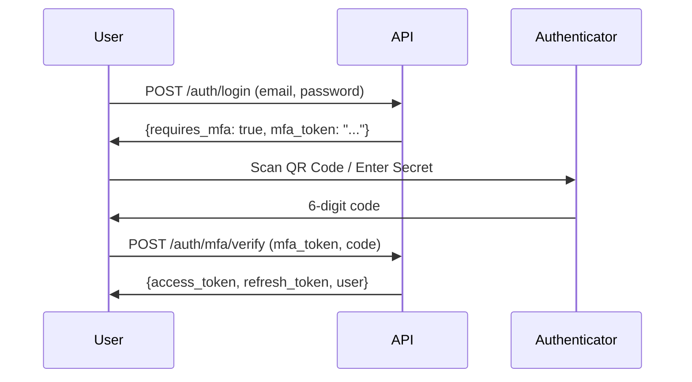

# Nudj Platform - Implementation Report

**Date**: 2026-02-09
**Version**: 1.0.0 (POC)
**Status**: ✅ Backend & Frontend Running

---

## Table of Contents
1. [Email Configuration](#email-configuration)
2. [Multi-Factor Authentication (MFA)](#multi-factor-authentication-mfa)
3. [Role-Based Functionalities](#role-based-functionalities)
4. [System Status](#system-status)

---

## 1. Email Configuration

### Current Setup

#### ⚠️ Email Provider: SendGrid (Default)
The system is currently configured to use **SendGrid** as the email provider:

```env
EMAIL_PROVIDER=sendgrid
SENDGRID_API_KEY=(empty - needs configuration)
EMAIL_FROM_ADDRESS=noreply@nudj.sa
EMAIL_FROM_NAME=Nudj Platform
```

#### Office365 SMTP Credentials (Available)
You provided Office365 SMTP credentials that need to be integrated:

```
Host: smtp.office365.com
Port: 587
TLS: Enabled
User: noreply@thrwty.com
Password: %d52WM\0jx8}
```

### 📧 Email Features Implemented

| Feature | Status | Trigger |
|---------|--------|---------|
| **Welcome Email** | ✅ Implemented | User registration via invitation |
| **Password Reset** | ✅ Implemented | Forgot password flow |
| **Invitation Email** | ✅ Implemented | Super Admin/Client Admin invites user |
| **Assessment Delegation** | ✅ Implemented | Client Admin delegates to Assessor |
| **Assessment Completion** | ✅ Implemented | Assessor completes all domains |
| **Report Ready** | ✅ Implemented | Report generation completes |

### Current Behavior

**In Development Mode (DEBUG=True)**:
- Email service runs in **MOCK MODE**
- Emails are logged to console instead of being sent
- No actual SMTP connection is made

```python
# From email_service.py
self.mock_mode = settings.ENVIRONMENT == "development" and not settings.SENDGRID_API_KEY
```

### ✅ TO ENABLE EMAIL SENDING

To activate real email sending with your Office365 credentials:

**Option 1: Update to Office365 SMTP** (Recommended for your setup)
1. Modify `src/backend/app/notifications/email_service.py` to support Office365
2. Update `.env` with Office365 credentials
3. Restart backend

**Option 2: Use SendGrid**
1. Get SendGrid API key
2. Add to `.env`: `SENDGRID_API_KEY=your_key_here`
3. Restart backend

---

## 2. Multi-Factor Authentication (MFA)

### ✅ MFA Status: **FULLY IMPLEMENTED**

The platform includes complete TOTP-based (Time-based One-Time Password) MFA implementation compatible with Google Authenticator, Microsoft Authenticator, and Authy.

### MFA Configuration

```env
MFA_ISSUER_NAME=Nudj Platform
# Currently disabled for all roles in development
MFA_MANDATORY_ROLES=[]
```

**Default Mandatory Roles** (in production):
```python
MFA_MANDATORY_ROLES: List[str] = ["super_admin", "analyst"]
```

### MFA Implementation Details

#### Technology
- **Library**: `pyotp` (Python TOTP library)
- **Algorithm**: TOTP (Time-Based One-Time Password)
- **Code Format**: 6-digit numeric code
- **Time Step**: 30 seconds
- **Valid Window**: ±30 seconds (tolerance for clock drift)

#### Features Implemented

| Feature | Endpoint | Description |
|---------|----------|-------------|
| **Setup MFA** | `GET /api/auth/mfa/setup` | Generate TOTP secret and QR code URI |
| **Enable MFA** | `POST /api/auth/mfa/enable` | Enable MFA after verification |
| **Verify MFA** | `POST /api/auth/mfa/verify` | Verify MFA code during login |
| **Disable MFA** | `POST /api/auth/mfa/disable` | Disable MFA (requires current code) |
| **Backup Codes** | Included in setup | 10 backup codes (8 chars each) |

#### MFA Flow



#### Setup Flow

1. **User requests MFA setup**
   ```bash
   GET /api/auth/mfa/setup
   ```

2. **Response includes**:
   ```json
   {
     "secret": "JBSWY3DPEHPK3PXP",
     "qr_code_uri": "otpauth://totp/Nudj%20Platform:user@example.com?secret=JBSWY3DPEHPK3PXP&issuer=Nudj%20Platform",
     "backup_codes": [
       "A1B2-C3D4",
       "E5F6-G7H8",
       ...
     ]
   }
   ```

3. **User scans QR code** with authenticator app

4. **User enables MFA** by verifying code:
   ```bash
   POST /api/auth/mfa/enable
   {
     "secret": "JBSWY3DPEHPK3PXP",
     "code": "123456"
   }
   ```

#### MFA Enforcement

**Current Status**: MFA is **optional** for all users (development mode)

**Production Enforcement**:
- Super Admin: **MANDATORY**
- Analyst: **MANDATORY**
- Client Admin: Optional
- Assessor: Optional

**Enforcement Mechanism**:
```python
# In auth/router.py login endpoint
if user.role.value in settings.MFA_MANDATORY_ROLES and not user.mfa_enabled:
    raise MFASetupRequiredException()
```

### Testing MFA

**Test User with MFA**:
```bash
# 1. Login as any test user
curl -X POST http://localhost:8000/api/auth/login \
  -H "Content-Type: application/json" \
  -d '{"email":"analyst@nudj.sa","password":"Test@2026"}'

# 2. Setup MFA
curl -X GET http://localhost:8000/api/auth/mfa/setup \
  -H "Authorization: Bearer <access_token>"

# 3. Enable MFA with code from authenticator
curl -X POST http://localhost:8000/api/auth/mfa/enable \
  -H "Authorization: Bearer <access_token>" \
  -d '{"secret":"SECRET_FROM_SETUP","code":"123456"}'

# 4. Login again - will now require MFA
curl -X POST http://localhost:8000/api/auth/login \
  -H "Content-Type: application/json" \
  -d '{"email":"analyst@nudj.sa","password":"Test@2026"}'
# Returns: {"requires_mfa":true,"mfa_token":"..."}

# 5. Complete MFA verification
curl -X POST http://localhost:8000/api/auth/mfa/verify \
  -H "Content-Type: application/json" \
  -d '{"mfa_token":"...","code":"654321"}'
```

---

## 3. Role-Based Functionalities

### System Roles

The platform implements 4 hierarchical roles:

```
┌─────────────────┐
│  SUPER_ADMIN    │ ← Platform-wide access
├─────────────────┤
│    ANALYST      │ ← Cross-organization consultant
├─────────────────┤
│  CLIENT_ADMIN   │ ← Organization administrator
├─────────────────┤
│    ASSESSOR     │ ← Domain-specific respondent
└─────────────────┘
```

---

### SUPER ADMIN (Platform Administrator)

**Access Level**: Platform-wide (no tenant isolation)

#### Core Capabilities

✅ **User Management** (Full Platform)
- List all users across all organizations
- Create/invite users with any role
- Update user roles and permissions
- Deactivate/reactivate users
- View user activity and audit logs

✅ **Organization Management**
- Create new organizations
- Update organization details
- View all organizations
- Delete organizations (soft delete)

✅ **Assessment Management**
- View all assessments across organizations
- Create assessments for any organization
- Modify assessment configurations
- Access all assessment responses and scores

✅ **Framework Configuration**
- Update domain definitions
- Modify maturity criteria
- Configure scoring weights
- Update assessment templates

✅ **Dashboard & Analytics**
- Portfolio dashboard (cross-org analytics)
- Platform-wide statistics
- User activity metrics
- Assessment completion rates

✅ **Audit & Compliance**
- View complete audit logs (all users, all orgs)
- Export audit logs as CSV
- Track all system events
- PDPL compliance monitoring

✅ **Reports**
- Generate reports for any assessment
- Download PDF reports
- Export assessment data

#### API Endpoints (Super Admin Only)

```
POST   /api/admin/users/invite           # Invite any role
PATCH  /api/admin/users/{id}             # Update any user
DELETE /api/admin/users/{id}             # Deactivate user
GET    /api/admin/audit-logs             # View all audit logs
GET    /api/admin/audit-logs/export      # Export audit logs
POST   /api/organizations/               # Create organization
PATCH  /api/framework/domains/{id}       # Update framework
GET    /api/dashboards/portfolio         # Portfolio dashboard
```

---

### ANALYST (HR Maturity Consultant)

**Access Level**: Assigned organizations only (via AnalystOrgAssignment)

#### Core Capabilities

✅ **Assessment Review**
- View assessments for assigned organizations
- Review assessment responses
- Add comments and recommendations
- Track maturity progress

✅ **Reporting**
- Generate maturity reports
- Download PDF assessment reports
- Export assessment data
- Create executive summaries

✅ **Organization Insights**
- View organization dashboards (assigned orgs)
- Track assessment completion
- Monitor scoring trends
- Compare against benchmarks

✅ **Collaboration**
- Add comments on assessment elements
- Provide expert recommendations
- Review evidence uploads
- Guide assessment process

#### Restrictions

❌ Cannot create/invite users
❌ Cannot modify organization details
❌ Cannot access unassigned organizations
❌ Cannot delete assessments
❌ Cannot configure framework

#### API Endpoints (Analyst)

```
GET    /api/assessments/                    # List assigned org assessments
GET    /api/assessments/{id}                # View assessment details
POST   /api/assessments/responses/{id}      # Submit responses
POST   /api/comments/                       # Add comments
GET    /api/dashboards/organization/{id}    # Org dashboard (if assigned)
GET    /api/reports/assessments/{id}/pdf    # Download report
```

---

### CLIENT ADMIN (Organization Administrator)

**Access Level**: Own organization only (strict tenant isolation)

#### Core Capabilities

✅ **Assessment Management**
- Create assessments for organization
- Configure assessment settings
- Monitor assessment progress
- Submit responses for own domains

✅ **Delegation Management**
- Delegate assessment domains to Assessors
- Assign multiple Assessors to assessment
- Track delegation status
- Revoke delegations

✅ **User Management** (Organization-scoped)
- Invite Assessors to organization
- Invite other Client Admins
- Update user profiles (own org)
- Deactivate users (own org)

✅ **Organization Dashboard**
- View organization maturity score
- Track assessment completion
- Monitor Assessor progress
- View domain-level scores

✅ **Reports**
- Download assessment reports
- View historical assessments
- Track maturity improvement

✅ **Collaboration**
- Add comments on assessments
- Review Assessor responses
- Provide context and clarifications

#### Restrictions

❌ Cannot access other organizations
❌ Cannot invite Super Admin or Analyst
❌ Cannot modify framework
❌ Cannot view audit logs
❌ Cannot see portfolio dashboard
❌ Cannot manage organization settings (only Super Admin can)

#### API Endpoints (Client Admin)

```
POST   /api/assessments/                        # Create assessment
GET    /api/assessments/                        # List org assessments
PATCH  /api/assessments/{id}                    # Update assessment
POST   /api/delegations/                        # Delegate to Assessor
GET    /api/delegations/assessment/{id}         # View delegations
POST   /api/admin/users/invite                  # Invite Assessor
GET    /api/dashboards/organization/{org_id}    # Own org dashboard
POST   /api/comments/                           # Add comments
```

---

### ASSESSOR (Domain Specialist)

**Access Level**: Assigned domains within delegated assessments only

#### Core Capabilities

✅ **Assessment Responses**
- Fill assigned assessment domains
- Upload evidence documents
- Add comments on elements
- Submit domain responses

✅ **Domain Access**
- View only assigned domains
- See domain-specific questions
- Access maturity criteria
- Review evidence requirements

✅ **Collaboration**
- Add comments on responses
- Reply to Client Admin feedback
- Request clarifications
- View domain history

#### Restrictions

❌ Cannot view full assessment
❌ Cannot access unassigned domains
❌ Cannot create assessments
❌ Cannot delegate to others
❌ Cannot invite users
❌ Cannot view organization dashboard
❌ Cannot generate reports
❌ Cannot modify assessment settings

#### API Endpoints (Assessor)

```
GET    /api/assessments/                     # List delegated assessments
GET    /api/assessments/{id}                 # View (domains filtered)
POST   /api/assessments/responses/{id}       # Submit response (assigned domains)
POST   /api/assessments/responses/{id}/evidence  # Upload evidence
POST   /api/comments/                        # Add comments
GET    /api/framework/domains                # View domain definitions
```

---

## 4. System Status

### ✅ Backend Services

| Service | Status | URL | Notes |
|---------|--------|-----|-------|
| **API Server** | ✅ Running | http://localhost:8000 | FastAPI + Uvicorn |
| **API Docs** | ✅ Available | http://localhost:8000/api/docs | Swagger UI |
| **Database** | ✅ Connected | PostgreSQL (localhost:5432) | 6 users, 3 orgs |
| **Rate Limiting** | ⚠️ Disabled | Development mode | Enabled in production |
| **CORS** | ✅ Configured | Ports 5173-5175 | Frontend allowed |

### ✅ Frontend Services

| Service | Status | URL | Notes |
|---------|--------|-----|-------|
| **Web App** | ✅ Running | http://localhost:5175 | React 19 + Vite |
| **HMR** | ✅ Active | - | Hot Module Replacement |

### ✅ Authentication

| Feature | Status | Notes |
|---------|--------|-------|
| **Login** | ✅ Working | Email + Password |
| **MFA** | ✅ Implemented | Optional (development) |
| **JWT Tokens** | ✅ Working | 15min access, 7day refresh |
| **Password Reset** | ✅ Implemented | Email flow ready |
| **Session Tracking** | ✅ Implemented | Multi-device support |

### ⚠️ Email Services

| Feature | Status | Configuration |
|---------|--------|---------------|
| **Email Provider** | ⚠️ Mock Mode | SendGrid API key not set |
| **Office365 SMTP** | ⚠️ Not Configured | Credentials available but not integrated |
| **Email Templates** | ✅ Implemented | Jinja2 templates ready |

**Action Required**: Configure email provider (see Section 1)

### ✅ Database

| Entity | Count | Notes |
|--------|-------|-------|
| **Users** | 6 | 1 super_admin, 1 analyst, 2 client_admin, 2 assessor |
| **Organizations** | 3 | Test organizations created |
| **Notifications** | 12 | 2 per user |
| **Assessments** | 0 | Ready to create |

---

## Implementation Summary

### ✅ Fully Implemented Features

1. **Authentication & Authorization**
   - Email/password login ✅
   - JWT-based sessions ✅
   - MFA (TOTP) ✅
   - Password reset flow ✅
   - Session management ✅

2. **Role-Based Access Control**
   - 4-tier role hierarchy ✅
   - Permission system ✅
   - Tenant isolation ✅
   - Role-specific endpoints ✅

3. **User Management**
   - User CRUD operations ✅
   - Invitation system ✅
   - Bulk invitations ✅
   - User profile management ✅

4. **Assessment System**
   - Assessment CRUD ✅
   - Domain delegation ✅
   - Response submission ✅
   - Evidence upload ✅

5. **Dashboards**
   - Portfolio dashboard (super admin) ✅
   - Organization dashboard ✅
   - Real-time metrics ✅

6. **Reports**
   - PDF generation ✅
   - Assessment reports ✅

7. **Notifications**
   - In-app notifications ✅
   - Notification management ✅
   - Email templates ✅

8. **Audit & Compliance**
   - Audit logging ✅
   - CSV export ✅
   - PDPL compliance tracking ✅

---

## Next Steps (Recommendations)

### Priority 1: Email Configuration
1. Choose email provider (Office365 or SendGrid)
2. Update email service configuration
3. Test email sending
4. Verify all email templates

### Priority 2: MFA Enforcement
1. Enable MFA for Super Admin and Analyst roles
2. Test MFA flow end-to-end
3. Document MFA setup for users
4. Create backup code recovery process

### Priority 3: Assessment Workflow
1. Create test assessment
2. Test delegation to Assessors
3. Complete assessment responses
4. Generate and review reports

### Priority 4: Production Readiness
1. Enable rate limiting
2. Configure proper JWT secrets
3. Set up encryption keys
4. Configure SSL/TLS
5. Set up monitoring and logging

---

## Support & Documentation

- **Test Credentials**: See `TEST_CREDENTIALS.md`
- **API Documentation**: http://localhost:8000/api/docs
- **Project Context**: `PROJECT_CONTEXT.md`
- **Coding Conventions**: `CLAUDE.md`

---

**Report Generated**: 2026-02-09
**Platform Version**: 1.0.0 (POC)
**Status**: ✅ Development Environment Ready
